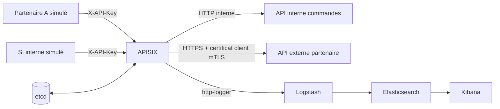

# Démonstration d'une chaîne d'interconnexion APISIX

Cette variante complète la stack APISIX minimale avec deux API fictives et une chaîne d'observabilité. Elle est conçue pour une VM Debian 12 de démonstration, pas pour la production.



Deux parcours sont disponibles :

- un partenaire authentifié appelle une API interne fictive via `/api/interne/orders` ;
- un SI interne appelle le backend du partenaire via `/partenaire-a/status`. APISIX présente alors un certificat client au serveur HTTPS partenaire.

Le plugin `http-logger` envoie les journaux des deux routes à Logstash. Ils sont indexés dans `apisix-demo-*` et consultables dans Kibana.

## Composants

| Conteneur | Rôle | Exposition hôte par défaut |
| --- | --- | --- |
| `apisix` | Gateway et Dashboard embarqué | `9080`, `9443`, `127.0.0.1:9180` |
| `apisix-etcd` | Configuration persistante APISIX | aucune |
| `internal-api` | API commandes fictive | aucune |
| `partner-api` | Backend partenaire HTTPS exigeant mTLS | aucune |
| `partner-client`, `si-client` | Clients réseau éphémères des scénarios | aucune |
| `logstash` | Réception des événements `http-logger` | aucune |
| `elasticsearch` | Stockage des journaux | `127.0.0.1:9200` |
| `kibana` | Recherche et visualisation | `127.0.0.1:5601` |

Les clients éphémères `partner-client` et `si-client` lancent les scénarios depuis deux zones distinctes. Les réseaux Docker internes `demo-entry`, `demo-si-entry`, `demo-internal`, `demo-partner`, `demo-observability` et `apisix-control` isolent les zones simulées. Le réseau `demo-management` porte uniquement les ports publiés d'APISIX, Elasticsearch et Kibana. Aucun backend n'est directement exposé au réseau de la VM.

## Prérequis Debian 12

- Docker Engine et le plugin Docker Compose opérationnels ;
- `python3`, `openssl`, `curl` et `jq` ;
- au moins 4 vCPU, 8 Go de RAM et 30 Go de disque recommandés pour l'ensemble de la démonstration ;
- `vm.max_map_count=1048576` pour Elasticsearch 9.

Installation des utilitaires manquants :

```bash
sudo apt update
sudo apt install -y python3 openssl curl jq
```

Le lanceur vérifie `vm.max_map_count` et propose de l'appliquer temporairement. Pour rendre le réglage persistant après validation par l'administrateur :

```bash
echo 'vm.max_map_count=1048576' | sudo tee /etc/sysctl.d/99-elasticsearch.conf
sudo sysctl --system
```

## Démarrage

Depuis la racine du dépôt :

```bash
./scripts/start-apisix-demo.sh
```

Le script effectue les opérations suivantes :

1. crée un `.env` local ignoré par Git et génère les clés si nécessaire ;
2. génère une autorité de certification et les certificats mTLS de démonstration dans `runtime/` ;
3. lit le classeur `AutoStack_Demo_APISIX.xlsx` et produit les objets APISIX attendus ;
4. télécharge et construit les images, puis attend les contrôles de santé ;
5. charge les upstreams, routes, consommateurs et credentials dans APISIX ;
6. crée la vue de données `apisix-demo-*` dans Kibana.

Une relance est idempotente : elle conserve les secrets, certificats et volumes existants, puis applique à nouveau la configuration du classeur. L'option `--yes` accepte les confirmations non destructives :

```bash
./scripts/start-apisix-demo.sh --yes
```

Si un `docker pull` échoue avec `x509: certificate signed by unknown authority`, installez de préférence l'autorité de certification de votre proxy. Pour le contournement temporaire réservé à la VM de test, utilisez le script documenté dans le [guide APISIX](README.md#contournement-temporaire-dune-inspection-tls), puis effectuez le démarrage de la démo dans la seconde fenêtre shell avant de réactiver TLS.

## Validation automatisée de la démonstration

```bash
./scripts/run-apisix-demo-scenarios.sh
```

Le script vérifie successivement :

1. le refus HTTP `401` d'une requête sans clé ;
2. l'accès du partenaire à l'API interne avec son identité APISIX ;
3. l'accès du SI interne au partenaire et la présence du certificat client mTLS ;
4. l'arrivée des événements APISIX dans Elasticsearch.

## Accès aux interfaces

Depuis un navigateur lancé dans la VM :

- Dashboard APISIX : <http://127.0.0.1:9180/ui/> ;
- Kibana Discover : <http://127.0.0.1:5601/app/discover> ;
- Elasticsearch : <http://127.0.0.1:9200>.

La clé du Dashboard se trouve dans le `.env` local :

```bash
grep '^APISIX_ADMIN_KEY=' services/APISIX/APISIX_demo_v3.18.0/.env
```

Depuis la machine hôte VirtualBox, le moyen le plus sûr consiste à ouvrir un tunnel SSH :

```bash
ssh \
  -L 9180:127.0.0.1:9180 \
  -L 5601:127.0.0.1:5601 \
  -L 9200:127.0.0.1:9200 \
  utilisateur@IP_DE_LA_VM
```

Les mêmes URL `127.0.0.1` sont ensuite utilisables sur l'hôte. Le port APISIX `9080` écoute sur toutes les interfaces de la VM par défaut ; utilisez l'adresse de la VM ou ajoutez un transfert de port VirtualBox si elle est en mode NAT.

## Modifier les données du classeur

Le générateur lit les feuilles `PARTNER`, `BACKEND`, `UPSTREAM`, `ROUTE`, `SECURITY` et `PLUGINS`. Pour cette première démo, chaque feuille de données doit contenir exactement une ligne. Les choix pris en charge sont :

- `AUTH_MODE=key-auth` ;
- `MTLS=TRUE` ;
- backend partenaire en `https` ;
- nom DNS simple et port compris entre `1` et `65535` pour le backend ;
- plugin `http-logger`.

Après une modification du classeur, relancez simplement :

```bash
./scripts/start-apisix-demo.sh
./scripts/run-apisix-demo-scenarios.sh
```

Les fichiers JSON générés se trouvent dans `services/APISIX/APISIX_demo_v3.18.0/runtime/generated/` et restent exclus de Git.

## Redémarrage de la VM

Les services persistants utilisent `restart: unless-stopped`. Activez aussi Docker au démarrage de Debian :

```bash
sudo systemctl enable docker
```

APISIX attend la santé d'etcd lors d'une création de stack. Après un redémarrage de la VM, les objets APISIX restent stockés dans le volume etcd et chaque backend devient disponible grâce à son propre contrôle de santé.

## Arrêt et remise à zéro

Arrêter les conteneurs sans perdre la configuration ni les journaux :

```bash
./scripts/stop-apisix-demo.sh
```

Supprimer également les volumes etcd et Elasticsearch :

```bash
./scripts/stop-apisix-demo.sh --volumes
```

Cette seconde commande demande une confirmation et efface les routes APISIX ainsi que les événements Kibana/Elasticsearch de la démonstration. Les secrets et certificats locaux restent présents dans `runtime/` et `.env`.

## Limites de sécurité

Cette variante désactive l'authentification d'Elasticsearch et de Kibana, qui ne sont liés qu'à `127.0.0.1`. Les certificats mTLS sont auto-signés, valables 30 jours et réservés à la démonstration. Ne réutilisez ni les clés ni cette configuration dans un environnement de production.
