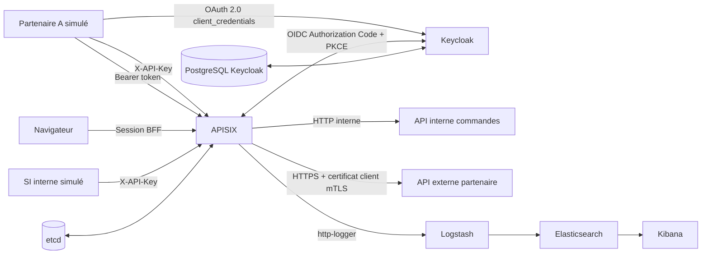

# Démonstration d'une chaîne d'interconnexion APISIX

Cette variante complète la stack APISIX minimale avec Keycloak, deux API fictives et une chaîne d'observabilité. Elle est conçue pour une VM Debian 12 de démonstration, pas pour la production.



Quatre parcours sont disponibles :

- un partenaire authentifié appelle une API interne fictive via `/api/interne/orders` ;
- un SI interne appelle le backend du partenaire via `/partenaire-a/status`. APISIX présente alors un certificat client au serveur HTTPS partenaire.
- un client technique obtient un jeton Keycloak avec `client_credentials`, puis appelle `/oidc/api/interne/orders` ;
- un navigateur ouvre `/bff/orders`, est redirigé vers Keycloak et revient avec une session HTTP-only gérée par APISIX.

Les routes historiques `key-auth` restent actives afin de comparer l'authentification locale et l'identité centralisée. Le plugin `http-logger` envoie les journaux à Logstash ; ils sont indexés dans `apisix-demo-*` et consultables dans Kibana.

## Composants

| Conteneur | Rôle | Exposition hôte par défaut |
| --- | --- | --- |
| `apisix` | Gateway et Dashboard embarqué | `9080`, `9443`, `127.0.0.1:9180` |
| `apisix-etcd` | Configuration persistante APISIX | aucune |
| `internal-api` | API commandes fictive | aucune |
| `partner-api` | Backend partenaire HTTPS exigeant mTLS | aucune |
| `keycloak` | Fournisseur d'identité OIDC et console d'administration | `127.0.0.1:8080` |
| `keycloak-db` | Base PostgreSQL persistante de Keycloak | aucune |
| `partner-client`, `si-client`, `oidc-partner-client` | Clients réseau éphémères des scénarios | aucune |
| `logstash` | Réception des événements `http-logger` | aucune |
| `elasticsearch` | Stockage des journaux | `127.0.0.1:9200` |
| `kibana` | Recherche et visualisation | `127.0.0.1:5601` |

Les clients éphémères lancent les scénarios depuis des zones distinctes. Le réseau interne `demo-identity` relie APISIX, Keycloak et le client OIDC ; les autres réseaux continuent d'isoler les zones d'entrée, les backends, l'observabilité et etcd. Le réseau `demo-management` porte uniquement les ports publiés d'APISIX, Keycloak, Elasticsearch et Kibana. Aucun backend ni aucune base de données n'est directement exposé au réseau de la VM.

## Prérequis Debian 12

- Docker Engine et le plugin Docker Compose opérationnels ;
- `python3`, `openssl`, `curl` et `jq` ;
- au moins 4 vCPU, 10 Go de RAM et 30 Go de disque recommandés pour l'ensemble de la démonstration ;
- `vm.max_map_count=1048576` pour Elasticsearch 9.

Connaitre la clé Admin pour APISIX :

```bash
grep '^APISIX_ADMIN_KEY=' services/APISIX/APISIX_demo_v3.18.0/.env
```

Installation des utilitaires manquants :

```bash
sudo apt update
sudo apt install -y python3 openssl curl jq
```

Le lanceur installe automatiquement `python3`, `openssl`, `curl`, `jq` et `ca-certificates` s'ils manquent sur Debian 12. Docker Engine et son plugin Compose doivent déjà être installés et démarrés. Il applique aussi temporairement `vm.max_map_count=1048576` si nécessaire. Une saisie du mot de passe `sudo` peut rester nécessaire selon la configuration de la VM.

Pour rendre le réglage Elasticsearch persistant :

```bash
echo 'vm.max_map_count=1048576' | sudo tee /etc/sysctl.d/99-elasticsearch.conf
sudo sysctl --system
```

## Démarrage

Depuis la racine du dossier APISIX (`cd services/APISIX` dans le dépôt complet) :

```bash
./scripts/start-apisix-demo.sh
```

Le script effectue les opérations suivantes :

1. crée un `.env` local ignoré par Git, impose `admin` / `42424242424242424242424242424242` pour les interfaces Keycloak et Kibana, réutilise ce mot de passe comme clé Admin APISIX et génère les secrets techniques ;
2. génère une autorité de certification et les certificats mTLS de démonstration dans `runtime/` ;
3. lit le classeur `AutoStack_Demo_APISIX.xlsx` et produit les objets APISIX attendus ;
4. démarre PostgreSQL et Keycloak, importe le realm `autostack` au premier lancement et réconcilie le compte administrateur d'un volume existant ;
5. active l'authentification Elastic, crée l'administrateur Kibana et les comptes techniques, puis attend les contrôles de santé ;
6. charge les upstreams, routes `key-auth`, routes OIDC, consommateurs et credentials dans APISIX ;
7. crée la vue de données `apisix-demo-*` dans Kibana ;
8. exécute les six scénarios de validation et ne rend la main que lorsque la démonstration est prête.

Une relance est idempotente : elle conserve les secrets techniques, certificats et volumes existants, réconcilie les accès administrateur, puis applique à nouveau la configuration du classeur. Le parcours est non interactif par défaut. Pour rétablir les confirmations ou ne pas rejouer les scénarios :

```bash
./scripts/start-apisix-demo.sh --interactive
./scripts/start-apisix-demo.sh --skip-scenarios
```

Si le premier `docker pull` échoue avec `x509: certificate signed by unknown authority`, le lanceur relève les domaines présents dans l'erreur, ajoute uniquement les exceptions Docker absentes, redémarre Docker, retente le téléchargement, puis retire immédiatement ses propres exceptions. La restauration est également déclenchée lors d'une interruption. Ce contournement automatique est limité à Debian 12 ; installer l'autorité de certification du proxy reste la correction durable.

## Rejouer la validation automatisée

```bash
./scripts/run-apisix-demo-scenarios.sh
```

Le lanceur exécute déjà cette validation. La commande ci-dessus permet de la rejouer et vérifie successivement :

1. le refus HTTP `401` d'une requête sans clé ;
2. l'accès du partenaire à l'API interne avec son identité APISIX ;
3. l'accès du SI interne au partenaire et la présence du certificat client mTLS ;
4. le refus HTTP `401` d'une requête OIDC sans access token ;
5. l'obtention d'un jeton par `client_credentials`, sa validation JWKS par APISIX et l'accès à l'API interne ;
6. l'arrivée des événements APISIX dans Elasticsearch.

## Démonstration Keycloak et BFF

La console Keycloak est disponible sur <http://127.0.0.1:8080/admin/>. Son compte administrateur est `admin` / `42424242424242424242424242424242`. Le mot de passe de l'utilisateur applicatif reste généré dans le `.env` local :

```bash
grep -E '^(KEYCLOAK_ADMIN_USERNAME|KEYCLOAK_ADMIN_PASSWORD|KEYCLOAK_DEMO_USER_PASSWORD)=' \
  APISIX_demo_v3.18.0/.env
```

Le realm applicatif est `autostack` et l'utilisateur navigateur est `architecte-demo`. Pour démontrer le parcours BFF, ouvrez :

<http://127.0.0.1:9080/bff/orders>

APISIX redirige vers Keycloak, échange le code d'autorisation avec PKCE, conserve les jetons dans une session chiffrée et HTTP-only, puis transmet la requête à l'API interne. La réponse JSON rend visibles les informations OIDC ajoutées par APISIX sans afficher le jeton. La déconnexion se fait via <http://127.0.0.1:9080/bff/logout>.

Pour reproduire manuellement le flux machine-à-machine :

```bash
set -a
. ./APISIX_demo_v3.18.0/.env
set +a

ACCESS_TOKEN="$(curl --fail --silent --show-error \
  -X POST "http://127.0.0.1:${KEYCLOAK_PORT}/realms/autostack/protocol/openid-connect/token" \
  -d grant_type=client_credentials \
  -d client_id=autostack-partner \
  --data-urlencode "client_secret=${KEYCLOAK_PARTNER_CLIENT_SECRET}" | jq -r .access_token)"

curl --fail --silent --show-error \
  -H "Authorization: Bearer ${ACCESS_TOKEN}" \
  "http://127.0.0.1:${APISIX_HTTP_PORT}/oidc/api/interne/orders" | jq

unset ACCESS_TOKEN
```

## Accès aux interfaces

Depuis un navigateur lancé dans la VM :

- Dashboard APISIX : <http://127.0.0.1:9180/ui/> ;
- console Keycloak : <http://127.0.0.1:8080/admin/> ;
- Kibana Discover : <http://127.0.0.1:5601/app/discover> ;
- Elasticsearch : <http://127.0.0.1:9200>.

Les accès humains de la démonstration sont homogènes :

| Interface | Utilisateur | Mot de passe ou clé |
| --- | --- | --- |
| Dashboard APISIX | aucun champ utilisateur | `42424242424242424242424242424242` |
| Console Keycloak | `admin` | `42424242424242424242424242424242` |
| Kibana | `admin` | `42424242424242424242424242424242` |
| API Elasticsearch | `admin` | `42424242424242424242424242424242` |

APISIX demande uniquement une clé Admin, car son Dashboard embarqué ne possède pas de couple utilisateur/mot de passe. Les valeurs effectivement appliquées se trouvent dans le `.env` local :

```bash
grep -E '^(APISIX_ADMIN_KEY|KEYCLOAK_ADMIN_USERNAME|KEYCLOAK_ADMIN_PASSWORD|ELASTIC_ADMIN_USERNAME|ELASTIC_ADMIN_PASSWORD)=' \
  APISIX_demo_v3.18.0/.env
```

Depuis la machine hôte VirtualBox, le moyen le plus sûr consiste à ouvrir un tunnel SSH :

```bash
ssh \
  -L 8080:127.0.0.1:8080 \
  -L 9080:127.0.0.1:9080 \
  -L 9180:127.0.0.1:9180 \
  -L 5601:127.0.0.1:5601 \
  -L 9200:127.0.0.1:9200 \
  utilisateur@IP_DE_LA_VM
```

Les mêmes URL `127.0.0.1` sont ensuite utilisables sur l'hôte et correspondent aux valeurs OIDC par défaut. Pour un accès direct par l'adresse de la VM, définissez `APISIX_PUBLIC_URL` et `KEYCLOAK_PUBLIC_URL` avec cette adresse dans `.env` avant le premier démarrage ; les URI publiques doivent rester cohérentes entre le navigateur, Keycloak et APISIX.

## Modifier les données du classeur

Le générateur lit les feuilles `PARTNER`, `BACKEND`, `UPSTREAM`, `ROUTE`, `SECURITY` et `PLUGINS`. Pour cette première démo, chaque feuille de données doit contenir exactement une ligne. Les choix pris en charge sont :

- `AUTH_MODE=key-auth` ;
- `MTLS=TRUE` ;
- backend partenaire en `https` ;
- nom DNS simple et port compris entre `1` et `65535` pour le backend ;
- plugin `http-logger`.

Après une modification du classeur, relancez simplement :

```bash
./scripts/start-apisix-demo.sh
./scripts/run-apisix-demo-scenarios.sh
```

Les fichiers JSON générés se trouvent dans `APISIX_demo_v3.18.0/runtime/generated/` et restent exclus de Git.

## Redémarrage de la VM

Les services persistants utilisent `restart: unless-stopped`. Activez aussi Docker au démarrage de Debian :

```bash
sudo systemctl enable docker
```

APISIX attend la santé d'etcd et Keycloak celle de PostgreSQL lors d'une création de stack. Après un redémarrage de la VM, les objets APISIX restent dans etcd, le realm Keycloak reste dans PostgreSQL et chaque composant devient disponible grâce à son contrôle de santé.

## Arrêt et remise à zéro

Arrêter les conteneurs sans perdre la configuration ni les journaux :

```bash
./scripts/stop-apisix-demo.sh
```

Supprimer également les volumes etcd, Elasticsearch et PostgreSQL Keycloak :

```bash
./scripts/stop-apisix-demo.sh --volumes
```

Cette seconde commande demande une confirmation et efface les routes APISIX, le realm Keycloak persistant et les événements Kibana/Elasticsearch de la démonstration. Les secrets et certificats locaux restent présents dans `runtime/` et `.env`.

## Limites de sécurité

Cette variante active l'authentification d'Elasticsearch et de Kibana, crée un compte humain commun et réserve des comptes techniques distincts aux échanges Kibana/Logstash. Les ports d'administration restent liés à `127.0.0.1`, mais les échanges Elastic locaux restent en HTTP. Keycloak fonctionne en mode `start-dev` sur HTTP avec `sslRequired=none`. Les cookies BFF ne portent donc pas l'attribut `Secure` dans cette démo locale. Les certificats mTLS sont auto-signés, valables 30 jours et réservés à la démonstration. Le mot de passe partagé est volontairement public et prévisible : ne réutilisez ni les clés, ni les mots de passe, ni cette configuration dans un environnement de production.
